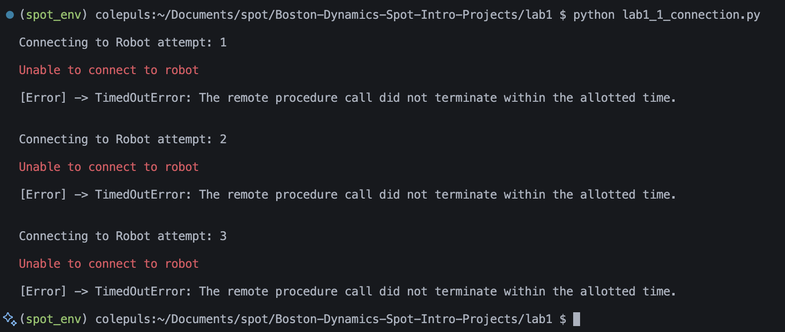
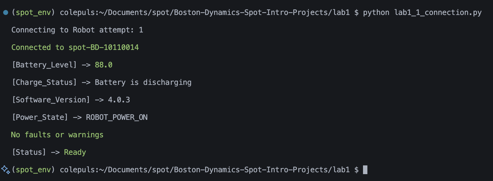

## Terminal Screen Shots

### Unable to connect output

### Connected output

## Errors encountered and how they were solved

- **Timeout Issue:** Initially overcomplicated the problem — the fix only required a single parameter.  
- **Traceback Printing:** Couldn’t suppress traceback output; solved it by calling `sys.exit()` before the traceback printed.  
- **Accessing Faults in SDK:** Learned how to access fault data through the SDK with LLM assistance.  
- **Serial Number Retrieval:** Tried to access the serial number from `robot_state` but couldn’t find the attribute; ended up getting it from `id_client` instead.  
- **Battery State Output:** Had trouble printing the battery state via the `BatteryState` API, resolved it by hardcoding strings in a large `if-else` block.  
- **Software Version:** Initially struggled to get the software version, but discovered the `create_strict_version()` method in the SDK.

## Reflection on what was learned about robot connection management

Learned how to access different components and data through the SDK, including robot state, faults, and battery information. Also gained a better understanding of how to manage timeouts and connection reliability by properly configuring parameters instead of overcomplicating them. Troubleshooting issues like traceback printing and serial number retrieval helped me understand how to handle errors and communication between the robot and the SDK. Overall, this process improved my confidence in navigating and debugging robot connection-related problems.